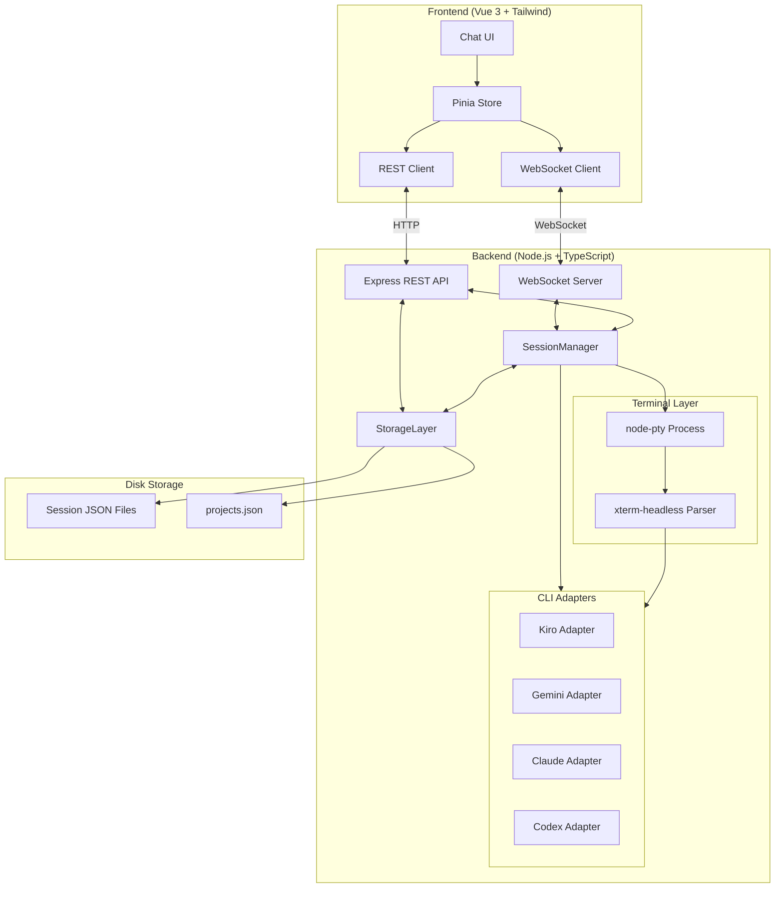
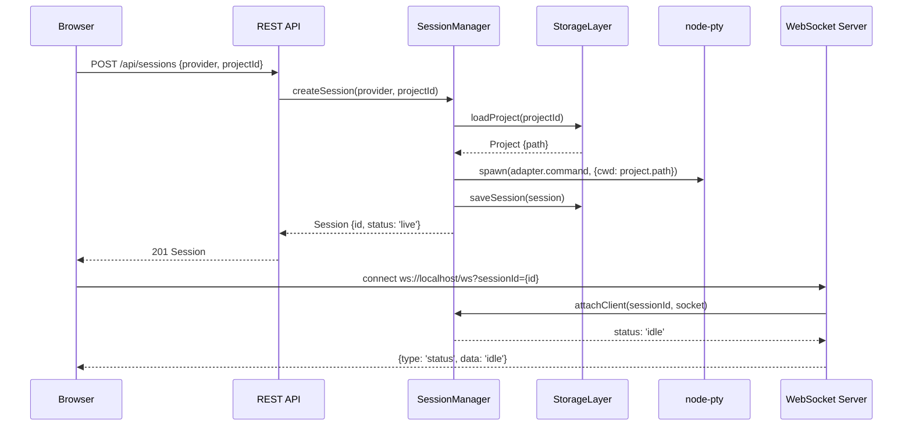
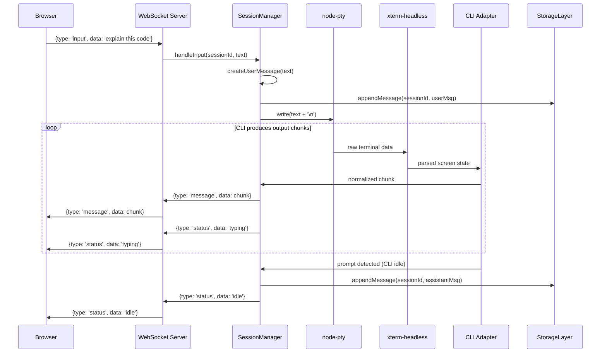
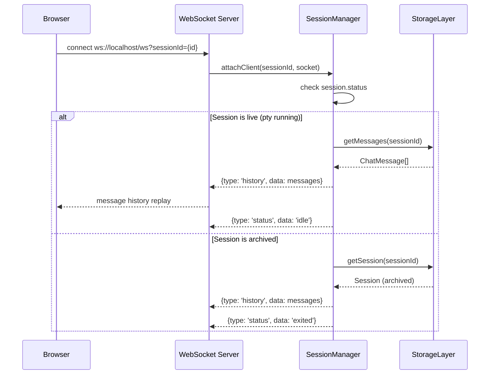

# Design Document: CodePipe MVP

## Overview

CodePipe is a web application that wraps AI-powered CLI tools (Kiro CLI, Gemini CLI, Claude Code, Codex) in a chat-style interface. Instead of interacting with these tools through a raw terminal, users get a familiar messaging UI with a conversation sidebar, chat bubbles, typing indicators, and markdown rendering — while the real CLI tools run under the hood via pseudo-terminals.

The backend is a Node.js + TypeScript server that spawns CLI processes using `node-pty`, parses their raw terminal output with `xterm-headless`, and streams normalized chat messages to the frontend over WebSocket. The frontend is a Vue 3 + Tailwind CSS single-page application that renders the stream as a chat conversation. Session history is persisted as JSON files on disk, and each CLI provider has a pluggable adapter that handles its specific output patterns.

The MVP targets localhost usage with optional remote access via Tailscale serve. There is no built-in authentication — the trust boundary is the machine or tailnet. Provider support is rolled out incrementally: Kiro CLI first, then Gemini CLI, Claude Code, and eventually Codex.

## Architecture



## Sequence Diagrams

### New Session Flow



### Message Send/Receive Flow



### Session Reconnection Flow



## Components and Interfaces

### Component 1: SessionManager

**Purpose**: Central orchestrator that creates, tracks, and destroys sessions. Each session owns a pty instance and a CLI adapter. Handles client attachment/detachment and reconnection.

**Interface**:
```typescript
interface ISessionManager {
  createSession(provider: ProviderType, projectId: string): Promise<Session>
  getSession(sessionId: string): Session | undefined
  listSessions(): SessionMeta[]
  deleteSession(sessionId: string): Promise<void>
  attachClient(sessionId: string, socket: WebSocket): void
  detachClient(sessionId: string, socket: WebSocket): void
  handleInput(sessionId: string, text: string): void
  shutdown(): Promise<void>
}
```

**Responsibilities**:
- Spawn and manage pty processes per session
- Route user input from WebSocket to the correct pty
- Route parsed CLI output from adapters back to attached WebSocket clients
- Persist messages to storage as they arrive
- Handle pty exit events (mark session as archived)
- Support multiple concurrent sessions
- Allow multiple browser tabs to attach to the same live session

### Component 2: CLI Adapter

**Purpose**: Pluggable parser layer that understands a specific CLI tool's output format. Converts raw parsed terminal state into normalized chat messages.

**Interface**:
```typescript
interface ICLIAdapter {
  readonly provider: ProviderType
  readonly command: string
  readonly args: string[]
  
  /** Called when xterm-headless produces new parsed screen content */
  onScreenUpdate(screenContent: string): AdapterEvent[]
  
  /** Reset adapter state (e.g., on session restart) */
  reset(): void
}

type AdapterEvent =
  | { type: 'chunk'; content: string; role: MessageRole }
  | { type: 'message_complete'; role: MessageRole }
  | { type: 'prompt_detected' }
  | { type: 'tool_use'; tool: string; input: string }
  | { type: 'thinking'; content: string }

type ProviderType = 'kiro' | 'gemini' | 'claude' | 'codex'
type MessageRole = 'assistant' | 'system' | 'tool'
```

**Responsibilities**:
- Define the CLI launch command and arguments
- Detect prompt patterns (CLI waiting for input)
- Detect message boundaries (where one response ends and the next begins)
- Recognize special blocks (tool use, code blocks, thinking indicators)
- Emit normalized events that SessionManager consumes
- Maintain internal parsing state between screen updates

### Component 3: StorageLayer

**Purpose**: Reads and writes JSON files for session persistence and project configuration. Thin abstraction over the filesystem.

**Interface**:
```typescript
interface IStorageLayer {
  // Sessions
  saveSession(session: Session): Promise<void>
  getSession(sessionId: string): Promise<Session | null>
  listSessions(): Promise<SessionMeta[]>
  deleteSession(sessionId: string): Promise<void>
  appendMessage(sessionId: string, message: ChatMessage): Promise<void>
  updateSessionStatus(sessionId: string, status: SessionStatus): Promise<void>

  // Projects
  listProjects(): Promise<Project[]>
  addProject(project: Omit<Project, 'id'>): Promise<Project>
  removeProject(projectId: string): Promise<void>
  getProject(projectId: string): Promise<Project | null>
}
```

**Responsibilities**:
- Read/write session JSON files in `data/sessions/`
- Read/write `data/projects.json`
- Ensure data directory structure exists on startup
- Handle concurrent write safety (write-then-rename for atomicity)
- Provide session metadata listing without loading full message history

### Component 4: WebSocket Server

**Purpose**: Manages WebSocket connections between browser clients and the SessionManager. Handles the real-time protocol for message streaming and status updates.

**Interface**:
```typescript
interface IWebSocketHandler {
  handleConnection(socket: WebSocket, sessionId: string): void
  broadcast(sessionId: string, message: WSServerMessage): void
  closeSession(sessionId: string): void
}

// Server → Client messages
type WSServerMessage =
  | { type: 'message'; data: ChatMessage }
  | { type: 'status'; data: SessionStatus }
  | { type: 'history'; data: ChatMessage[] }
  | { type: 'error'; data: string }

// Client → Server messages
type WSClientMessage =
  | { type: 'input'; data: string }

type SessionStatus = 'typing' | 'idle' | 'exited'
```

**Responsibilities**:
- Accept WebSocket connections with sessionId query parameter
- Validate that the requested session exists
- Forward incoming `input` messages to SessionManager
- Broadcast outgoing messages/status to all clients attached to a session
- Handle disconnection cleanup

### Component 5: Express REST API

**Purpose**: HTTP endpoints for CRUD operations on sessions and projects. Stateless request/response — no streaming. All request bodies are validated with Zod schemas before processing.

**Endpoints**:

| Method | Path | Description |
|--------|------|-------------|
| `GET` | `/api/sessions` | List all sessions (metadata only) |
| `POST` | `/api/sessions` | Create a new session |
| `GET` | `/api/sessions/:id` | Get session with message history |
| `DELETE` | `/api/sessions/:id` | Archive or delete a session |
| `GET` | `/api/projects` | List all projects |
| `POST` | `/api/projects` | Add a project |
| `DELETE` | `/api/projects/:id` | Remove a project |

### Component 6: Frontend — Pinia Store

**Purpose**: Global state management for the Vue frontend. Holds session list, active session, project list, and WebSocket connection state.

**Interface**:
```typescript
// Session Store
interface SessionStore {
  sessions: SessionMeta[]
  activeSessionId: string | null
  activeMessages: ChatMessage[]
  sessionStatus: SessionStatus
  
  fetchSessions(): Promise<void>
  createSession(provider: ProviderType, projectId: string): Promise<Session>
  selectSession(sessionId: string): Promise<void>
  deleteSession(sessionId: string): Promise<void>
}

// Project Store
interface ProjectStore {
  projects: Project[]
  
  fetchProjects(): Promise<void>
  addProject(name: string, path: string): Promise<Project>
  removeProject(projectId: string): Promise<void>
}
```

### Component 7: Frontend — useSession Composable

**Purpose**: Manages the WebSocket connection lifecycle for the active session. Handles connecting, reconnecting, sending input, and receiving messages/status updates.

**Interface**:
```typescript
interface UseSessionReturn {
  connect(sessionId: string): void
  disconnect(): void
  sendMessage(text: string): void
  isConnected: Ref<boolean>
  connectionError: Ref<string | null>
}
```

## Data Models

All data models are defined as Zod schemas, which serve as both the TypeScript type definitions and runtime validators. Types are inferred from schemas using `z.infer<>` so there is a single source of truth.

### Zod Schema Definitions

```typescript
import { z } from 'zod'

// --- Enums & Primitives ---

const ProviderTypeSchema = z.enum(['kiro', 'gemini', 'claude', 'codex'])

const SessionStatusSchema = z.enum(['live', 'archived'])

const MessageRoleSchema = z.enum(['user', 'assistant', 'system', 'tool'])

const MessageStatusSchema = z.enum(['streaming', 'complete'])

// --- Core Models ---

const ChatMessageMetadataSchema = z.object({
  toolName: z.string().optional(),
  thinkingContent: z.string().optional(),
})

const ChatMessageSchema = z.object({
  id: z.string().uuid(),
  role: MessageRoleSchema,
  content: z.string(),                    // can be empty for streaming start
  timestamp: z.number().int().positive(),
  status: MessageStatusSchema,
  metadata: ChatMessageMetadataSchema.optional(),
})

const ProjectSchema = z.object({
  id: z.string().uuid(),
  name: z.string().min(1).max(100),
  path: z.string().startsWith('/'),       // absolute path (POSIX)
})

const SessionSchema = z.object({
  id: z.string().uuid(),
  provider: ProviderTypeSchema,
  projectId: z.string().uuid(),
  title: z.string().min(1).max(200),
  createdAt: z.number().int().positive(),
  updatedAt: z.number().int().positive(),
  status: SessionStatusSchema,
  messages: z.array(ChatMessageSchema),
}).refine(s => s.updatedAt >= s.createdAt, {
  message: 'updatedAt must be >= createdAt',
})

const SessionMetaSchema = SessionSchema.omit({ messages: true })

// --- WebSocket Protocol ---

const WSClientMessageSchema = z.discriminatedUnion('type', [
  z.object({ type: z.literal('input'), data: z.string().min(1) }),
])

const WSServerMessageSchema = z.discriminatedUnion('type', [
  z.object({ type: z.literal('message'), data: ChatMessageSchema }),
  z.object({ type: z.literal('status'), data: z.enum(['typing', 'idle', 'exited']) }),
  z.object({ type: z.literal('history'), data: z.array(ChatMessageSchema) }),
  z.object({ type: z.literal('error'), data: z.string() }),
])

// --- REST API Request Bodies ---

const CreateSessionRequestSchema = z.object({
  provider: ProviderTypeSchema,
  projectId: z.string().uuid(),
})

const CreateProjectRequestSchema = z.object({
  name: z.string().min(1).max(100),
  path: z.string().startsWith('/'),
})

// --- Inferred Types ---

type ProviderType = z.infer<typeof ProviderTypeSchema>
type SessionStatus = z.infer<typeof SessionStatusSchema>
type MessageRole = z.infer<typeof MessageRoleSchema>
type ChatMessage = z.infer<typeof ChatMessageSchema>
type Project = z.infer<typeof ProjectSchema>
type Session = z.infer<typeof SessionSchema>
type SessionMeta = z.infer<typeof SessionMetaSchema>
type WSClientMessage = z.infer<typeof WSClientMessageSchema>
type WSServerMessage = z.infer<typeof WSServerMessageSchema>
type CreateSessionRequest = z.infer<typeof CreateSessionRequestSchema>
type CreateProjectRequest = z.infer<typeof CreateProjectRequestSchema>
```

### Validation Strategy

Zod schemas are used at every trust boundary:

| Boundary | Schema | Purpose |
|----------|--------|---------|
| REST request body | `CreateSessionRequestSchema`, `CreateProjectRequestSchema` | Validate incoming HTTP payloads |
| WebSocket incoming | `WSClientMessageSchema` | Validate client messages before processing |
| Storage read | `SessionSchema`, `ProjectSchema` | Validate data loaded from JSON files (guards against corruption) |
| Storage write | `SessionSchema`, `ProjectSchema` | Validate data before persisting (defense in depth) |

Validation errors at REST boundaries return 400 with Zod's formatted error messages. Validation errors on WebSocket messages send `{ type: 'error', data: 'Invalid message format' }` and ignore the message. Storage validation errors are logged and surfaced as system messages.

### Session

**Validation Rules** (enforced by `SessionSchema`):
- `id` must be a valid UUID v4
- `provider` must be one of the supported provider types
- `projectId` must be a valid UUID referencing an existing project
- `title` is non-empty, max 200 characters
- `createdAt` and `updatedAt` are positive integers
- `updatedAt >= createdAt` (enforced by `.refine()`)
- `messages` array contains valid `ChatMessage` objects ordered by timestamp ascending

### ChatMessage

**Validation Rules** (enforced by `ChatMessageSchema`):
- `id` must be a valid UUID v4
- `role` must be one of the four allowed values
- `content` can be empty string (for streaming start) but not null/undefined
- `timestamp` is a positive integer
- `status` transitions only from `streaming` → `complete`, never backwards
- User messages are always `complete` on creation
- Assistant messages start as `streaming` and transition to `complete`

### Project

**Validation Rules** (enforced by `ProjectSchema`):
- `id` must be a valid UUID v4
- `name` is non-empty, max 100 characters
- `path` must be an absolute path (starts with `/`)
- `path` should reference an existing directory (validated on creation, not on every read)


## Key Functions with Formal Specifications

### Function 1: SessionManager.createSession()

```typescript
async function createSession(
  provider: ProviderType,
  projectId: string
): Promise<Session>
```

**Preconditions:**
- `provider` is one of `'kiro' | 'gemini' | 'claude' | 'codex'`
- `projectId` references an existing project in storage
- The project's `path` is an existing directory on disk
- The CLI binary for the given provider is installed and available on `$PATH`

**Postconditions:**
- Returns a `Session` with `status === 'live'` and an empty `messages` array
- A pty process has been spawned running the provider's CLI command in the project directory
- The session is persisted to `data/sessions/{id}.json`
- The session is tracked in the SessionManager's in-memory map
- `session.createdAt === session.updatedAt`

**Loop Invariants:** N/A

### Function 2: SessionManager.handleInput()

```typescript
function handleInput(sessionId: string, text: string): void
```

**Preconditions:**
- `sessionId` references a session in the manager's active sessions map
- The session's status is `'live'` (pty is running)
- `text` is a non-empty string

**Postconditions:**
- A user `ChatMessage` with `status: 'complete'` is created and appended to the session
- The text (with trailing newline) is written to the pty's stdin
- The message is persisted to storage
- All attached WebSocket clients receive the user message

**Loop Invariants:** N/A

### Function 3: CLIAdapter.onScreenUpdate()

```typescript
function onScreenUpdate(screenContent: string): AdapterEvent[]
```

**Preconditions:**
- `screenContent` is a string representing the current terminal screen state from xterm-headless
- The adapter's internal state is consistent (not corrupted by prior errors)

**Postconditions:**
- Returns zero or more `AdapterEvent` objects
- If a prompt pattern is detected, the last event is `{ type: 'prompt_detected' }`
- Chunk events contain only new content not previously emitted
- The adapter's internal state is updated to reflect the new screen position
- No side effects outside the adapter's own state

**Loop Invariants:**
- The adapter's `lastProcessedPosition` always advances forward, never backwards
- All content between `lastProcessedPosition` and current position is accounted for in emitted events

### Function 4: StorageLayer.appendMessage()

```typescript
async function appendMessage(
  sessionId: string,
  message: ChatMessage
): Promise<void>
```

**Preconditions:**
- `sessionId` references an existing session file on disk
- `message` has a valid `id`, `role`, `timestamp`, and `status`
- `message.timestamp >= session.updatedAt` (messages are appended in order)

**Postconditions:**
- The message is appended to the session's `messages` array in the JSON file
- `session.updatedAt` is set to `message.timestamp`
- The file write is atomic (write to temp file, then rename)
- If the write fails, the original file is unchanged

**Loop Invariants:** N/A

### Function 5: WebSocketHandler.handleConnection()

```typescript
function handleConnection(socket: WebSocket, sessionId: string): void
```

**Preconditions:**
- `socket` is an open WebSocket connection
- `sessionId` is provided as a query parameter

**Postconditions:**
- If session exists and is live: client is attached, receives history replay, then status `'idle'`
- If session exists and is archived: client receives history replay, then status `'exited'`
- If session does not exist: client receives `{ type: 'error', data: 'Session not found' }` and socket is closed
- Event listeners are registered for `message` and `close` events on the socket

**Loop Invariants:** N/A

## Algorithmic Pseudocode

### Session Creation Algorithm

```typescript
// ALGORITHM: createSession
// INPUT: provider (ProviderType), projectId (string)
// OUTPUT: Session object with live pty

async function createSession(provider: ProviderType, projectId: string): Promise<Session> {
  // Step 1: Validate project exists
  const project = await storage.getProject(projectId)
  assert(project !== null, 'Project must exist')
  assert(existsSync(project.path), 'Project path must exist on disk')

  // Step 2: Resolve CLI adapter for provider
  const adapter = adapterRegistry.get(provider)
  assert(adapter !== undefined, 'Provider must have a registered adapter')

  // Step 3: Create session record
  const session: Session = {
    id: randomUUID(),
    provider,
    projectId,
    title: `New ${provider} session`,
    createdAt: Date.now(),
    updatedAt: Date.now(),
    status: 'live',
    messages: []
  }

  // Step 4: Spawn pty process
  const pty = spawn(adapter.command, adapter.args, {
    cwd: project.path,
    cols: 120,
    rows: 40,
    env: { ...process.env, TERM: 'xterm-256color' }
  })

  // Step 5: Wire up xterm-headless parser
  const terminal = new Terminal({ cols: 120, rows: 40 })
  pty.onData((data: string) => {
    terminal.write(data)
    const screenContent = serializeScreen(terminal)
    const events = adapter.onScreenUpdate(screenContent)
    processAdapterEvents(session.id, events)
  })

  // Step 6: Handle pty exit
  pty.onExit(({ exitCode }) => {
    session.status = 'archived'
    storage.updateSessionStatus(session.id, 'archived')
    broadcast(session.id, { type: 'status', data: 'exited' })
  })

  // Step 7: Track and persist
  activeSessions.set(session.id, { session, pty, terminal, adapter, clients: new Set() })
  await storage.saveSession(session)

  return session
}
```

### Adapter Event Processing Algorithm

```typescript
// ALGORITHM: processAdapterEvents
// INPUT: sessionId (string), events (AdapterEvent[])
// OUTPUT: side effects — messages broadcast to clients, persisted to storage
// INVARIANT: events are processed in order; each chunk extends the current streaming message

function processAdapterEvents(sessionId: string, events: AdapterEvent[]): void {
  const ctx = activeSessions.get(sessionId)
  assert(ctx !== undefined, 'Session must be active')

  for (const event of events) {
    // INVARIANT: at most one streaming message exists per session at any time
    switch (event.type) {
      case 'chunk': {
        if (!ctx.currentMessage || ctx.currentMessage.status === 'complete') {
          // Start a new streaming message
          ctx.currentMessage = {
            id: randomUUID(),
            role: event.role,
            content: event.content,
            timestamp: Date.now(),
            status: 'streaming'
          }
          broadcast(sessionId, { type: 'message', data: ctx.currentMessage })
        } else {
          // Append to existing streaming message
          ctx.currentMessage.content += event.content
          broadcast(sessionId, { type: 'message', data: ctx.currentMessage })
        }
        broadcast(sessionId, { type: 'status', data: 'typing' })
        break
      }

      case 'message_complete': {
        if (ctx.currentMessage && ctx.currentMessage.status === 'streaming') {
          ctx.currentMessage.status = 'complete'
          storage.appendMessage(sessionId, ctx.currentMessage)
          broadcast(sessionId, { type: 'message', data: ctx.currentMessage })
        }
        break
      }

      case 'prompt_detected': {
        // Finalize any in-progress message
        if (ctx.currentMessage && ctx.currentMessage.status === 'streaming') {
          ctx.currentMessage.status = 'complete'
          storage.appendMessage(sessionId, ctx.currentMessage)
          broadcast(sessionId, { type: 'message', data: ctx.currentMessage })
        }
        ctx.currentMessage = null
        broadcast(sessionId, { type: 'status', data: 'idle' })
        break
      }

      case 'tool_use': {
        const toolMsg: ChatMessage = {
          id: randomUUID(),
          role: 'tool',
          content: event.input,
          timestamp: Date.now(),
          status: 'complete',
          metadata: { toolName: event.tool }
        }
        storage.appendMessage(sessionId, toolMsg)
        broadcast(sessionId, { type: 'message', data: toolMsg })
        break
      }

      case 'thinking': {
        // Thinking blocks are transient — broadcast but don't persist
        broadcast(sessionId, {
          type: 'message',
          data: {
            id: randomUUID(),
            role: 'system',
            content: event.content,
            timestamp: Date.now(),
            status: 'complete',
            metadata: { thinkingContent: event.content }
          }
        })
        break
      }
    }
  }
}
```

### User Input Handling Algorithm

```typescript
// ALGORITHM: handleInput
// INPUT: sessionId (string), text (string)
// OUTPUT: side effects — user message persisted, text written to pty
// PRECONDITION: session is live, text is non-empty

function handleInput(sessionId: string, text: string): void {
  const ctx = activeSessions.get(sessionId)
  assert(ctx !== undefined, 'Session must be active')
  assert(ctx.session.status === 'live', 'Session must be live to accept input')
  assert(text.length > 0, 'Input text must be non-empty')

  // Step 1: Create and persist user message
  const userMessage: ChatMessage = {
    id: randomUUID(),
    role: 'user',
    content: text,
    timestamp: Date.now(),
    status: 'complete'
  }
  storage.appendMessage(sessionId, userMessage)

  // Step 2: Broadcast user message to all attached clients
  broadcast(sessionId, { type: 'message', data: userMessage })

  // Step 3: Write to pty stdin (the CLI sees this as keyboard input)
  ctx.pty.write(text + '\n')

  // Step 4: Update session timestamp
  ctx.session.updatedAt = Date.now()
}
```

### WebSocket Connection Algorithm

```typescript
// ALGORITHM: handleConnection
// INPUT: socket (WebSocket), sessionId (string)
// OUTPUT: side effects — client attached to session, history replayed

function handleConnection(socket: WebSocket, sessionId: string): void {
  // Step 1: Validate session exists
  const ctx = activeSessions.get(sessionId)
  if (!ctx) {
    // Check if it's an archived session in storage
    storage.getSession(sessionId).then(session => {
      if (session) {
        // Replay history for archived session
        socket.send(JSON.stringify({ type: 'history', data: session.messages }))
        socket.send(JSON.stringify({ type: 'status', data: 'exited' }))
      } else {
        socket.send(JSON.stringify({ type: 'error', data: 'Session not found' }))
        socket.close()
      }
    })
    return
  }

  // Step 2: Attach client to live session
  ctx.clients.add(socket)

  // Step 3: Replay message history
  socket.send(JSON.stringify({ type: 'history', data: ctx.session.messages }))

  // Step 4: Send current status
  const status = ctx.currentMessage?.status === 'streaming' ? 'typing' : 'idle'
  socket.send(JSON.stringify({ type: 'status', data: status }))

  // Step 5: Handle incoming messages (validated with Zod)
  socket.on('message', (raw: string) => {
    const parsed = WSClientMessageSchema.safeParse(JSON.parse(raw))
    if (!parsed.success) {
      socket.send(JSON.stringify({ type: 'error', data: 'Invalid message format' }))
      return
    }
    const msg = parsed.data
    if (msg.type === 'input') {
      handleInput(sessionId, msg.data)
    }
  })

  // Step 6: Handle disconnection
  socket.on('close', () => {
    ctx.clients.delete(socket)
  })
}
```

### Atomic File Write Algorithm

```typescript
// ALGORITHM: atomicWrite
// INPUT: filePath (string), data (object)
// OUTPUT: side effects — file written atomically
// POSTCONDITION: either the file contains the new data, or the old data is preserved

async function atomicWrite(filePath: string, data: object): Promise<void> {
  const tempPath = filePath + '.tmp.' + randomUUID()
  
  // Step 1: Write to temporary file
  await writeFile(tempPath, JSON.stringify(data, null, 2), 'utf-8')
  
  // Step 2: Atomic rename (POSIX guarantees this is atomic on same filesystem)
  await rename(tempPath, filePath)
}
```

## Example Usage

### Backend: Creating a Session and Sending a Message

```typescript
import { SessionManager } from './session-manager'
import { StorageLayer } from './storage'
import { KiroAdapter } from './adapters/kiro'

// Initialize
const storage = new StorageLayer('./data')
const manager = new SessionManager(storage)
manager.registerAdapter('kiro', () => new KiroAdapter())

// Create a session
const session = await manager.createSession('kiro', 'project-abc-123')
console.log(session.id)     // '550e8400-e29b-41d4-a716-446655440000'
console.log(session.status)  // 'live'

// Attach a WebSocket client (done by WebSocket server on connection)
manager.attachClient(session.id, websocket)

// Handle user input (done by WebSocket server on message)
manager.handleInput(session.id, 'What files are in this project?')
```

### Frontend: Connecting to a Session

```typescript
// composables/useSession.ts
import { ref } from 'vue'
import type { ChatMessage, SessionStatus, WSServerMessage } from '@/types'

export function useSession() {
  const isConnected = ref(false)
  const connectionError = ref<string | null>(null)
  let ws: WebSocket | null = null

  function connect(sessionId: string) {
    ws = new WebSocket(`ws://localhost:3000/ws?sessionId=${sessionId}`)

    ws.onopen = () => {
      isConnected.value = true
      connectionError.value = null
    }

    ws.onmessage = (event) => {
      const msg: WSServerMessage = JSON.parse(event.data)
      const sessionStore = useSessionStore()

      switch (msg.type) {
        case 'history':
          sessionStore.activeMessages = msg.data
          break
        case 'message':
          sessionStore.upsertMessage(msg.data)
          break
        case 'status':
          sessionStore.sessionStatus = msg.data
          break
        case 'error':
          connectionError.value = msg.data
          break
      }
    }

    ws.onclose = () => {
      isConnected.value = false
    }
  }

  function sendMessage(text: string) {
    if (ws?.readyState === WebSocket.OPEN) {
      ws.send(JSON.stringify({ type: 'input', data: text }))
    }
  }

  function disconnect() {
    ws?.close()
    ws = null
    isConnected.value = false
  }

  return { connect, disconnect, sendMessage, isConnected, connectionError }
}
```

### Frontend: Chat Input Component

```vue
<!-- components/ChatInput.vue -->
<script setup lang="ts">
import { ref } from 'vue'
import { useSession } from '@/composables/useSession'

const { sendMessage } = useSession()
const input = ref('')

function handleSend() {
  const text = input.value.trim()
  if (!text) return
  sendMessage(text)
  input.value = ''
}

function handleKeydown(e: KeyboardEvent) {
  if (e.key === 'Enter' && !e.shiftKey) {
    e.preventDefault()
    handleSend()
  }
}
</script>

<template>
  <div class="border-t border-gray-200 dark:border-gray-700 p-4">
    <div class="flex gap-2 mb-2">
      <ProjectSelector />
      <ProviderSelector />
    </div>
    <div class="flex gap-2">
      <textarea
        v-model="input"
        @keydown="handleKeydown"
        placeholder="Send a message..."
        rows="1"
        class="flex-1 resize-none rounded-lg border border-gray-300 dark:border-gray-600 
               bg-white dark:bg-gray-800 px-4 py-2 text-sm
               focus:outline-none focus:ring-2 focus:ring-blue-500"
      />
      <button
        @click="handleSend"
        :disabled="!input.trim()"
        class="rounded-lg bg-blue-600 px-4 py-2 text-white text-sm
               hover:bg-blue-700 disabled:opacity-50 disabled:cursor-not-allowed"
      >
        Send
      </button>
    </div>
  </div>
</template>
```

## Correctness Properties

The following properties must hold for the system to be correct. These are expressed as universal quantification statements suitable for property-based testing.

### P1: Message Ordering Preservation

**∀ session s, ∀ messages m₁, m₂ in s.messages:**
If `indexOf(m₁) < indexOf(m₂)` then `m₁.timestamp <= m₂.timestamp`.

Messages in a session are always ordered by timestamp. No message can appear before a message with an earlier timestamp.

### P2: Session Status Consistency

**∀ session s:**
- If `s.status === 'live'` then there exists an active pty process for `s.id`
- If `s.status === 'archived'` then no pty process exists for `s.id`
- Status transitions only from `live → archived`, never `archived → live`

### P3: Message Status Monotonicity

**∀ message m:**
- `m.status` transitions only from `'streaming' → 'complete'`
- Once `m.status === 'complete'`, it never changes
- User messages (`m.role === 'user'`) are always created with `status: 'complete'`

### P4: Atomic Storage Writes

**∀ write operation w on session file f:**
- Either `f` contains the complete new data, or `f` contains the complete old data
- No partial writes are observable by concurrent readers
- If the process crashes during write, the original file is preserved

### P5: Client Broadcast Completeness

**∀ session s, ∀ WebSocket clients c₁, c₂ attached to s:**
If `c₁` and `c₂` are both attached when event `e` occurs, both receive `e`. No attached client is skipped during broadcast.

### P6: Input-Output Correspondence

**∀ user input i sent to session s:**
- A user `ChatMessage` with `content === i` is persisted to storage
- The text `i + '\n'` is written to the pty's stdin
- The user message is broadcast to all attached clients

### P7: Adapter Idempotent Screen Processing

**∀ adapter a, ∀ screen states s₁, s₂ where s₁ is a prefix of s₂:**
- `a.onScreenUpdate(s₁)` followed by `a.onScreenUpdate(s₂)` produces events only for the new content in `s₂`
- No content is emitted twice
- `a.lastProcessedPosition` monotonically increases

### P8: Session Reconnection Fidelity

**∀ session s, ∀ client c connecting to s:**
- `c` receives the complete message history of `s` on connection
- The history matches what is persisted in storage
- After history replay, `c` receives the correct current status

### P9: Concurrent Session Independence

**∀ sessions s₁, s₂ where s₁.id ≠ s₂.id:**
- Input to `s₁` never affects `s₂`'s pty
- Output from `s₁`'s pty is never broadcast to `s₂`'s clients
- Storage operations on `s₁` do not corrupt `s₂`'s data

### P10: Project Path Validation

**∀ project p:**
- `p.path` is an absolute path
- On creation, `p.path` must reference an existing directory
- `p.name` is non-empty and at most 100 characters
- `p.id` is a valid UUID v4

## Error Handling

### Error Scenario 1: PTY Process Crash

**Condition**: The CLI process exits unexpectedly (non-zero exit code, signal kill, etc.)
**Response**: SessionManager catches the `onExit` event, marks the session as `'archived'`, and broadcasts `{ type: 'status', data: 'exited' }` to all attached clients. A system message is appended to the session: "CLI process exited with code {exitCode}".
**Recovery**: User can view the session history. Starting a new session is the recovery path — sessions are not restartable.

### Error Scenario 2: WebSocket Disconnection

**Condition**: Browser tab closes, network drops, or client disconnects unexpectedly.
**Response**: The `close` event handler removes the client from the session's client set. The pty continues running — the session is not affected.
**Recovery**: Client reconnects by opening a new WebSocket to the same sessionId. History is replayed and the client resumes receiving live updates.

### Error Scenario 3: Storage Write Failure

**Condition**: Disk full, permission error, or filesystem issue during JSON write.
**Response**: The atomic write fails at the temp file stage — the original session file is preserved. The error is logged server-side. A system message is broadcast to attached clients: "Failed to save message — session data may be incomplete."
**Recovery**: Subsequent writes are retried. In-memory state remains correct even if persistence fails.

### Error Scenario 4: CLI Binary Not Found

**Condition**: User tries to create a session with a provider whose CLI is not installed.
**Response**: `spawn()` throws an error. SessionManager catches it, does not create the session, and returns a 400 error to the REST client: "CLI binary '{command}' not found. Please install {provider}."
**Recovery**: User installs the CLI tool and retries.

### Error Scenario 5: Invalid Project Path

**Condition**: User creates a session with a project whose path no longer exists on disk.
**Response**: SessionManager validates the path before spawning. Returns 400: "Project path '{path}' does not exist."
**Recovery**: User updates or removes the stale project and adds the correct path.

### Error Scenario 6: Concurrent WebSocket Messages

**Condition**: Multiple browser tabs send input to the same live session simultaneously.
**Response**: Messages are processed in the order they arrive at the server. Each input is written to the pty sequentially. The CLI tool sees them as sequential keystrokes.
**Recovery**: No special recovery needed — this is expected behavior. The chat history reflects the actual order of inputs.

## Testing Strategy

### Unit Testing Approach

- **CLI Adapters**: Test each adapter with recorded terminal output snapshots. Verify that `onScreenUpdate()` produces the correct sequence of `AdapterEvent` objects for known CLI output patterns. Test prompt detection, message boundary detection, and special block recognition.
- **StorageLayer**: Test CRUD operations on session and project JSON files. Verify atomic writes, concurrent read safety, and correct data serialization/deserialization.
- **SessionManager**: Test session lifecycle (create → input → output → archive) with mocked pty and storage. Verify client attachment/detachment and broadcast behavior.
- **WebSocket Protocol**: Test message serialization/deserialization. Verify that malformed messages are handled gracefully.

### Property-Based Testing Approach

**Property Test Library**: `fast-check`

- **Message ordering**: Generate random sequences of messages and verify timestamp ordering is maintained after insertion.
- **Adapter idempotency**: Generate random terminal output strings and verify that processing them in chunks produces the same result as processing them all at once.
- **Storage round-trip**: Generate random Session objects and verify that `save → load` produces identical data.
- **WebSocket protocol**: Generate random WSClientMessage objects and verify they are handled without crashes.

### Integration Testing Approach

- **End-to-end session flow**: Spawn a real pty with a simple echo command (not a real CLI), send input, verify output arrives via WebSocket.
- **Multi-client reconnection**: Connect two WebSocket clients to the same session, disconnect one, send a message, reconnect, verify history is consistent.
- **Storage persistence**: Create a session, send messages, restart the server, verify session and messages are loaded correctly.

## Performance Considerations

- **PTY output buffering**: xterm-headless screen serialization on every data event could be expensive. Debounce screen reads (e.g., 50ms) to batch rapid output bursts into single adapter calls.
- **Message broadcast**: For sessions with many attached clients, iterate the client set and send in parallel. Use `setImmediate` to avoid blocking the event loop on large broadcasts.
- **Storage writes**: Debounce message persistence — don't write to disk on every chunk. Batch writes every 500ms or on message completion, whichever comes first.
- **Session list loading**: `listSessions()` should read only metadata (first few fields of each JSON file) without loading full message arrays. Consider a separate `sessions-index.json` if the number of sessions grows large.
- **Memory**: Each live session holds an xterm-headless Terminal instance (configurable buffer size). Cap the scrollback buffer to prevent unbounded memory growth.

## Security Considerations

- **Localhost binding**: The server binds to `127.0.0.1` only. No external network access without Tailscale.
- **No authentication**: Trust boundary is the machine. Tailscale handles auth for remote access.
- **Path traversal**: Validate that project paths are absolute and do not contain `..` sequences that could escape intended directories.
- **Input sanitization**: User input is written directly to the pty as keystrokes. The CLI tool itself handles any dangerous input. CodePipe does not execute user input — it passes it through.
- **WebSocket origin**: Optionally validate the `Origin` header on WebSocket connections to prevent cross-site WebSocket hijacking from malicious web pages.
- **Process isolation**: Each pty runs as the same user as the server. No sandboxing in the MVP — the CLI tools have full access to the filesystem within the project directory.

## Dependencies

| Package | Purpose | Version Strategy |
|---------|---------|-----------------|
| `express` | HTTP server and REST routing | Pin major |
| `ws` | WebSocket server | Pin major |
| `node-pty` | Pseudo-terminal spawning | Pin major |
| `xterm-headless` | Terminal output parsing | Pin major |
| `zod` | Schema validation & type inference | Pin major |
| `uuid` | UUID v4 generation | Pin major |
| `vue` | Frontend framework | ^3.x |
| `tailwindcss` | Utility-first CSS | ^3.x |
| `vite` | Frontend build tool | ^5.x |
| `pinia` | Vue state management | ^2.x |
| `vue-router` | Client-side routing | ^4.x |
| `markdown-it` | Markdown rendering | Pin major |
| `fast-check` | Property-based testing | Pin major |
| `vitest` | Test runner | Pin major |
